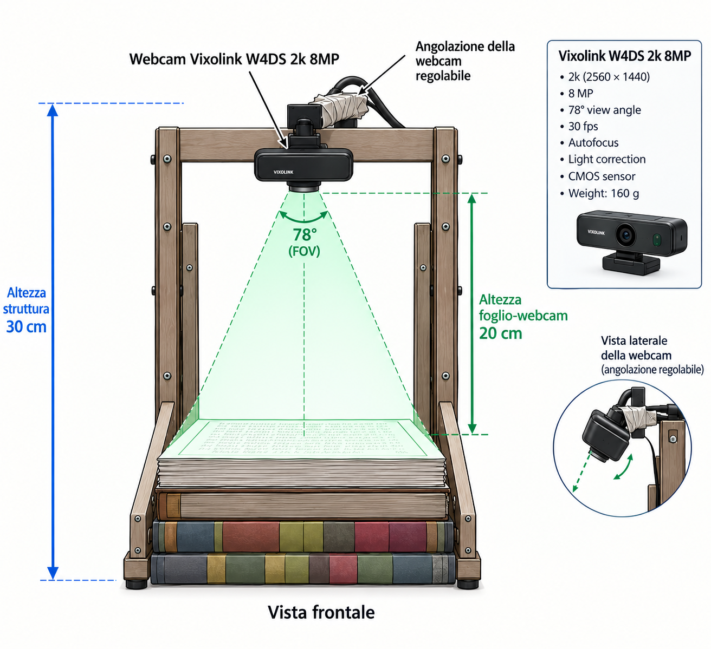

# ✍️ HandVerify

**HandVerify** is a **handwriting-based biometric verification system**: given two handwritten samples — even with **different text content** (text-independent verification) — the system determines whether they were produced by the **same person**.

The project covers the full pipeline: preprocessing of the IAM/RIMES datasets, training neural networks with three different paradigms (BCE Siamese, Contrastive, Triplet) across multiple backbones, rigorous biometric evaluation (EER, AUC, FAR/FRR, d-prime), statistical analysis of results, and a **live webcam demo**.

> Academic/research repository (thesis/report included in `report/`), not a production-ready product.

---

## Table of Contents

- [✍️ HandVerify](#️-handverify)
  - [Table of Contents](#table-of-contents)
  - [How it works](#how-it-works)
  - [Repository structure](#repository-structure)
    - [The `src/` package](#the-src-package)
  - [Installation](#installation)
  - [Datasets](#datasets)
  - [Webcam demo](#webcam-demo)
    - [Hardware rig](#hardware-rig)
  - [Training](#training)
  - [Evaluation and metrics](#evaluation-and-metrics)
  - [Main results](#main-results)
  - [Notebooks](#notebooks)
  - [Training notebooks on Kaggle](#training-notebooks-on-kaggle)
  - [License](#license)

---

## How it works

The system learns an **embedding space** in which handwriting images from the same author are close together and those from different authors are far apart, regardless of the written text. Images (grayscale, 448×448 by default) are passed through a CNN backbone (ResNet, EfficientNet, MobileNetV3, ...), and verification is performed by comparing the two embeddings via **cosine similarity** against a calibrated threshold (e.g. EER — Equal Error Rate).

Three training paradigms are supported, all built on the same data/model/trainer infrastructure in `src/`:

| Paradigm | Input | Loss | Output |
|---|---|---|---|
| **BCE / Siamese** | image pair | Binary Cross-Entropy | similarity probability (0-1) |
| **Contrastive** | image pair | Contrastive loss (cosine-based) | L2-normalized embeddings |
| **Triplet** | (anchor, positive, negative) | Triplet loss (cosine-based) | L2-normalized embeddings |

For each paradigm, multiple backbones are available and interchangeable via a **model registry** (`src/models/registry.py`): ResNet18/34/50, EfficientNet-B0/B1/V2, MobileNetV3 Small/Large, DenseNet121, RegNetY-400MF.

## Repository structure

```
HandVerify/
├── src/                        # Main Python package
│   ├── data/                   # Datasets (Siamese/Contrastive/Triplet) + DataLoader factory
│   ├── models/                  # CNN backbones, classification/projection heads, registry
│   ├── training/                # Trainers for BCE/Contrastive/Triplet, loss functions
│   ├── evaluation/               # Biometric verification metrics (EER, AUC, FAR/FRR, d-prime...)
│   └── utils/                   # Seed, device, checkpoint, logging
├── notebooks/                   # Dataset preprocessing, training, results analysis, EDA
├── webcam-demo/demo/            # Live webcam demo (PySide/OpenCV)
├── results/                     # Trained checkpoints, final metrics, logs
├── report/                      # LaTeX report (compiled PDF included) + user manual
├── docs/                        # MkDocs documentation (getting started, API reference, etc.)
├── dataset-links.txt            # Links to the public datasets used (IAM, RIMES, CEDAR)
├── main.py                      # Placeholder entry point
├── pyproject.toml               # Dependencies (managed with uv)
└── uv.lock
```

### The `src/` package

- **`src/data`** — `BaseWriterDataset` is the common abstract class: it organizes images by writer, generates **all** possible genuine pairs (same author) and a pool of impostor pairs (different authors), and resamples negatives every N epochs while maintaining a configurable `positive_ratio`. `SiameseDataset`, `ContrastiveDataset` and `TripletDataset` extend it for the three paradigms. `dataloader_factory.py` provides functions for train/val/test splits over *writers* (never over images, to avoid leakage), cross-dataset splits (train on one domain, val/test on another) and K-Fold.
- **`src/models`** — `BaseSiameseNetwork`, `BaseContrastiveNetwork`, `BaseTripletNetwork` define the common architecture (encoder + MLP head with progressive BatchNorm/Dropout, optional freezing of the backbone's first layers). `get_model(name, model_type, ...)` instantiates any backbone × paradigm combination from the registry.
- **`src/training`** — `BaseTrainer` handles the training/validation loop, early stopping, checkpoint saving (`_best.pth` / `_final.pth`) and comprehensive biometric evaluation at the end of training. `BCETrainer`, `ContrastiveTrainer`, `TripletTrainer` implement the paradigm-specific logic. Losses available in `losses.py`: `BCELoss`, `ContrastiveLoss`, `TripletLoss`, `CombinedLoss`.
- **`src/evaluation`** — `compute_metrics()` computes ROC/AUC, **EER**, classification metrics at the EER threshold, operating points at fixed FAR (1% and 0.1%), **d-prime**/decidability, and statistics of the genuine/impostor score distributions.

## Installation

The project uses **[uv](https://github.com/astral-sh/uv)** as package/environment manager (requires Python ≥ 3.12).

```bash
git clone https://github.com/lorenzo-arcioni/HandVerify.git
cd HandVerify
uv sync
```

Main dependencies (see `pyproject.toml`): `torch`/`torchvision` (CPU build, `2.9.1+cpu`), `albumentations`, `opencv-python-headless`, `pyside6` (webcam demo GUI), `scikit-learn`, `pandas`, `numpy`, `matplotlib`, `seaborn`, `jupytext`, `kaggle`.

> For the documentation (optional): `uv sync --group dev` installs `mkdocs`, `mkdocs-material`, `mkdocstrings[python]`.

## Datasets

The system expects data organized as **one folder per writer**, each with ≥ 2 images:

```
data_root/
├── writer_001/
│   ├── img_001.png
│   └── img_002.png
├── writer_002/
│   └── ...
```

Public datasets used for the experiments (links in [`dataset-links.txt`](dataset-links.txt)):

- **[IAM Handwriting Database](https://fki.tic.heia-fr.ch/databases/download-the-iam-handwriting-database)** (also on [Kaggle](https://www.kaggle.com/datasets/naderabdelghany/iam-handwritten-forms-dataset))
- **[RIMES](https://www.kaggle.com/datasets/chaimaourgani/handwritten2text-training-dataset)**
- **[CEDAR](https://www.kaggle.com/datasets/shreelakshmigp/cedardataset)** (signatures, for additional experiments)

Preprocessing (Otsu binarization, removal of borders/guide lines, tight-crop via axial projections, resize to 448×448, plus line batching for RIMES) is documented step by step in the notebooks `IAM_Preprocessing_Step_by_Step.ipynb` and `RIMES_Preprocessing_Step_by_Step.ipynb`, and executed in bulk in `Datasets Preprocessing.ipynb`.

## Webcam demo

`webcam-demo/demo/` contains a live demo based on the **ResNet18 + Contrastive** model trained on IAM: you frame two handwriting samples with the webcam and the system tells you whether they belong to the same person (score = cosine similarity between embeddings).

### Hardware rig



The demo runs on a small wooden copy-stand built specifically to reproduce IAM-like acquisition conditions (flat page, uniform lighting, fixed distance) as closely as possible:

- **Frame height: 30 cm** — overall height of the wooden stand, measured from the base to the top crossbar where the camera is mounted.
- **Page-to-webcam distance: 20 cm** — vertical distance between the sheet of paper and the webcam lens; the stack of books under the sheet is used to fine-tune this distance and keep the page in focus.
- **Adjustable camera angle** — the webcam is mounted on a swivel/hinge bracket (see side-view detail) so it can be tilted to keep the page perfectly centered and parallel to the sensor, compensating for small misalignments of the stand.
- **Camera: Vixolink W4DS 2K 8MP** — the webcam used for capture, with the following specs relevant to image quality:
  - **2K resolution** (2560 × 1440)
  - **8 MP** sensor
  - **78° field of view (FOV)**, wide enough to cover the full page from 20 cm without cropping
  - **30 fps**
  - **Autofocus**, to keep the page sharp despite small distance variations
  - **Automatic light correction**, which helps compensate for uneven ambient lighting
  - **CMOS sensor**
  - **Weight: 160 g**

This fixed, top-down, distance-and-angle-controlled setup is what keeps the webcam frames close enough to the IAM domain (flat page, consistent scale, minimal perspective distortion) for the preprocessing pipeline (`preprocess.py`) to work reliably — see the "Known limitation" note below on the remaining domain gap.

```bash
cd webcam-demo/demo
QT_PLUGIN_PATH="" LD_LIBRARY_PATH="" uv run python webcam_demo.py \
    --camera 4 \
    --checkpoint ../../results/demo/resnet18_contrastive_mixed_iam_rimes_stratified_best.pth \
    --threshold eer
```

Main features:
- **dual** capture mode (both samples in the same frame, one per box) or **single** mode (`M`, one sample at a time, recommended for better quality);
- diagnostic side panel with **focus** (Laplacian variance) and **ink percentage** indicators;
- switchable preprocessing: `scan` (shadow/background removal) or `raw` (key `B`);
- thresholds automatically read from the metrics CSV associated with the checkpoint (`eer`, `far1`, `far01`), or set manually with `--threshold-value`;
- saving of captures and logs (`captures/`, `log.csv`) and dump of preprocessing stages for debugging (`X`).

⚠️ **Known limitation**: the model is trained on IAM scans (white paper, dark pen, no shadows) mixed with RIMES (white paper, semi-binary ink). Webcam photos are a different domain: preprocessing reduces but does not eliminate the gap, so the demo is a qualitative demonstration, not a quantitative evaluation — see the cross-dataset results below. Full guide, keyboard shortcuts and troubleshooting in [`webcam-demo/demo/README.md`](webcam-demo/demo/README.md).

## Training

Minimal example using the `src/` API (see also `docs/docs/getting-started.md` for more extensive examples):

```python
from src.utils import set_seed, get_device
from src.models import get_model
from src.data import create_contrastive_dataloaders
from src.training import ContrastiveTrainer

set_seed(42)
device = get_device()

train_loader, val_loader, test_loader, train_ds, val_ds, test_ds = create_contrastive_dataloaders(
    data_root="data/iam_processed",
    batch_size=16,
    val_size=0.10,
    test_size=0.10,
)

model = get_model("resnet18", model_type="contrastive",
                   embedding_dim=128, freeze_backbone_layers=3, dropout=0.4)

trainer = ContrastiveTrainer(model, model_name="resnet18_contrastive",
                              device=device, margin=0.5, results_dir="results/exp1")

history, metrics = trainer.train(train_loader, val_loader, val_dataset=val_ds,
                                  epochs=50, patience=7)
```

For **cross-dataset** training (train on one domain, val/test on another) use `create_cross_dataset_dataloaders` / `create_*_cross_dataset_dataloaders`; for K-Fold cross-validation, `create_kfold_dataloaders` / `create_*_kfold_dataloaders`.

The notebook `notebooks/train_configurable_loss.ipynb` documents the training of the final model used in the demo — **ResNet18** on **combined IAM + RIMES** — with a selectable loss via `CONFIG['loss_type']` — and includes two important safeguards:

- `writer_id`s are prefixed with the source dataset (`iam__042`, `rimes__042`) so a genuine pair can never accidentally mix two different datasets;
- the impostor pair pool is explicitly **stratified** (IAM-IAM / RIMES-RIMES / cross-dataset) to avoid bias towards one domain.

Each run saves to `results/<experiment>/`:

```
<model_name>_best.pth               # checkpoint with the best validation loss
<model_name>_final.pth              # checkpoint from the last epoch
<model_name>_history.csv            # train/val loss per epoch
<model_name>_final_metrics.csv      # full verification metrics on the val/test set
```

## Evaluation and metrics

`src/evaluation/metrics.py::compute_metrics()` computes, from the genuine/impostor score distributions:

- **AUC-ROC** and **EER** (Equal Error Rate) with the corresponding threshold;
- Accuracy / Precision / Recall / F1 at the EER threshold;
- **operating points** at FAR = 1% and FAR = 0.1% (FRR, GAR, corresponding threshold);
- **d-prime** and decidability index (separation between the two distributions);
- statistics (mean/standard deviation) of the genuine/impostor distributions, for plotting.

The full statistical analysis — bootstrap CIs, normality checks, ROC/DET curves, AUC/EER heatmaps per backbone × loss, pairwise Wilcoxon tests between losses, identification of known confounding factors — is in `notebooks/biometric_results_analysis_v3.ipynb`. `notebooks/failure_cases_extraction.ipynb` extracts and analyzes the worst false-accept/false-reject cases (`top_false_accepts_*.csv`, `top_false_rejects_*.csv`).

## Main results

Experiments on **6 backbones × 3 losses × 4 splits** (`iam_to_iam`, `rimes_to_rimes` = same domain; `iam_to_rimes`, `rimes_to_iam` = cross-dataset), aggregated in `notebooks/same_dataset_aggregated.csv` and `notebooks/cross_dataset_aggregated.csv`:

| Loss | Split | AUC (mean) | EER (mean) |
|---|---|---|---|
| Contrastive | IAM → IAM (same domain) | **0.990** | **4.9%** |
| Contrastive | RIMES → RIMES (same domain) | 0.927 | 12.9% |
| BCE | IAM → IAM (same domain) | 0.956 | 9.0% |
| Triplet | IAM → IAM (same domain) | 0.924 | 15.3% |
| Contrastive | RIMES → IAM (cross-dataset) | 0.950 | 11.7% |
| Contrastive | IAM → RIMES (cross-dataset) | 0.738 | 32.2% |

**Best individual configurations** (`notebooks/ours_best_per_split.csv`): Contrastive + MobileNetV3-Large on IAM→IAM reaches **AUC 0.995 / EER 3.1%**; Contrastive + ResNet18 on RIMES→RIMES reaches **AUC 0.934 / EER 11.5%** (the checkpoint used in the webcam demo, trained on mixed IAM+RIMES).

The pattern that emerges across all experiments: **same-dataset performance is good-to-excellent, while cross-dataset performance degrades sharply** (up to -25 AUC points in the IAM→RIMES case), confirming a significant domain gap between the two datasets — discussed in depth in the report and explicitly called out as a limitation in the demo as well.

## Notebooks

| Notebook | Content |
|---|---|
| `Datasets Preprocessing.ipynb` | Full preprocessing pipeline for IAM and RIMES (Otsu, tight-crop, resize) |
| `IAM_Preprocessing_Step_by_Step.ipynb` | IAM preprocessing explained step by step, with intermediate visualizations |
| `RIMES_Preprocessing_Step_by_Step.ipynb` | Same for RIMES, including text-line batching |
| `Processed Dataset EDA.ipynb` | Exploratory data analysis of the datasets after preprocessing |
| `Dimensionality Analysis.ipynb` | Analysis of the dimensionality/quality of the learned embeddings |
| `train_configurable_loss.ipynb` | Training of the final model (ResNet18, mixed IAM+RIMES, configurable loss) |
| `Results Analysis.ipynb` / `biometric_results_analysis_v3.ipynb` | Table extraction and full statistical analysis of results (72 configurations) |
| `failure_cases_extraction.ipynb` | Extraction of the worst failure cases for qualitative debugging |
| `final_validation_best_model.ipynb` | Validation of the best model on a new dataset (template to be configured) |

## Training notebooks on Kaggle

The actual (GPU) training experiments were run on Kaggle, in several versions by loss type and purpose; the local/jupytext counterparts in `notebooks/` are the working/exported versions of these notebooks:

| Kaggle notebook | Description |
|---|---|
| [Handwriting Verification with BCE Loss](https://www.kaggle.com/code/lorenzoarcioni/handwriting-verification-with-bce-loss) | Training and evaluation of the backbones with the **BCE / Siamese** paradigm |
| [Handwriting Verification with Contrastive Loss](https://www.kaggle.com/code/lorenzoarcioni/handwriting-verification-with-contrastive-loss) | Training and evaluation of the backbones with **Contrastive Loss** |
| [Handwriting Verification with Triplet Loss](https://www.kaggle.com/code/lorenzoarcioni/handwriting-verification-with-triplet-loss) | Training and evaluation of the backbones with **Triplet Loss** |
| [Final Train for Demo — HandVerify](https://www.kaggle.com/code/lorenzoarcioni/final-train-for-demo-handverify) | Training of the final model used in the webcam demo (ResNet18 Contrastive, mixed and stratified IAM+RIMES) |
| [Handwriting: Best Model Final Validation](https://www.kaggle.com/code/lorenzoarcioni/handwriting-best-model-final-validation) | Exhaustive validation of the best model on a complete held-out dataset (all genuine + impostor pairs) |

## License

Distributed under the **[GPL-3.0](LICENSE)** license.